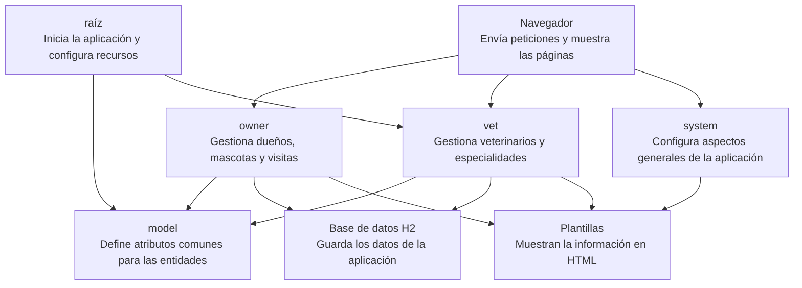

# Mapa de Componentes

| Paquete | Clases | Responsabilidad | Depende de |
|---------|--------|----------------|------------|
| model | BaseEntity, NamedEntity, Person | Define atributos comunes para las entidades del sistema | Ninguno |
| owner | Owner, OwnerController, OwnerRepository, Pet, PetController, PetType, PetTypeFormatter, PetTypeRepository, PetValidator, Visit, VisitController | Gestiona propietarios, mascotas y sus visitas | model |
| vet | Specialty, Vet, VetController, VetRepository, Vets | Gestiona la información de los veterinarios y sus especialidades | model |
| system | CacheConfiguration, CrashController, WebConfiguration, WelcomeController | Configura aspectos generales y funciones básicas de la aplicación | Ninguno |
| (raíz) | PetClinicApplication, PetClinicRuntimeHints | Inicia la aplicación y configura los recursos necesarios para su ejecución | model, vet |

# Flujo: ficha de un dueño

1. En el navegador se solicita `GET /owners/1`.
2. `OwnerController.java` - `showOwner()` recibe el `ownerId` y pide la información del dueño.
3. `OwnerRepository.java` - `findById()` busca al dueño por su id. Spring Data JPA se encarga de implementar esa búsqueda.
4. `Owner.java` - representa al dueño y se relaciona con la tabla `owners`.
5. `db/h2/schema.sql` - aquí está definida la tabla `owners`, donde se guardan los datos del dueño.
6. `OwnerController.java` - `showOwner()` agrega el `owner` al modelo y envía la vista `owners/ownerDetails`.
7. `templates/owners/ownerDetails.html` - recibe los datos del `owner` y los muestra en la página.

# Diagrama de mapa de componentes

# Preguntas

### 1. Si mañana piden registrar vacunas por mascota, ¿qué cajas del mapa tocarías y cuáles no?

Tendría que modificar `owner`, porque ahí se encuentran las mascotas y la lógica relacionada con ellas. También tendría que modificar la base de datos H2 para guardar la información de las vacunas y las plantillas para poder registrarlas y mostrarlas.

En principio no sería necesario modificar `vet`, `system`, la raíz ni `model`, porque la funcionalidad estaría directamente relacionada  con las mascotas y no cambia las características comunes de las entidades ni la configuración general de la aplicación.

### 2. De todo lo que viste hoy, ¿qué es estructural y qué es acabado? Da un ejemplo de cada uno.

Un cambio estructural sería modificar cómo se maneja el `id` en `BaseEntity`, ya que varias entidades como `Owner`, `Pet`, `Visit` y `Vet` dependen directa o indirectamente de esa clase, por lo que el cambio podría afectar también repositorios y tablas de la base de datos.

Un cambio de acabado sería modificar la forma en que se muestran los datos del dueño en `ownerDetails.html`, por ejemplo cambiar el orden de los campos o su presentación. Eso cambia la interfaz que ve el usuario, pero no obliga a modificar el controlador, el repositorio ni la base de datos.